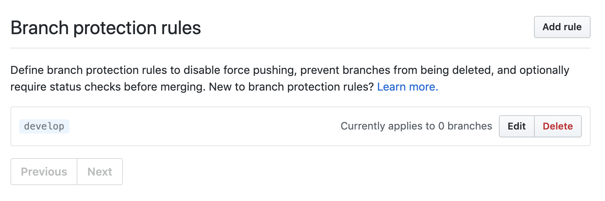
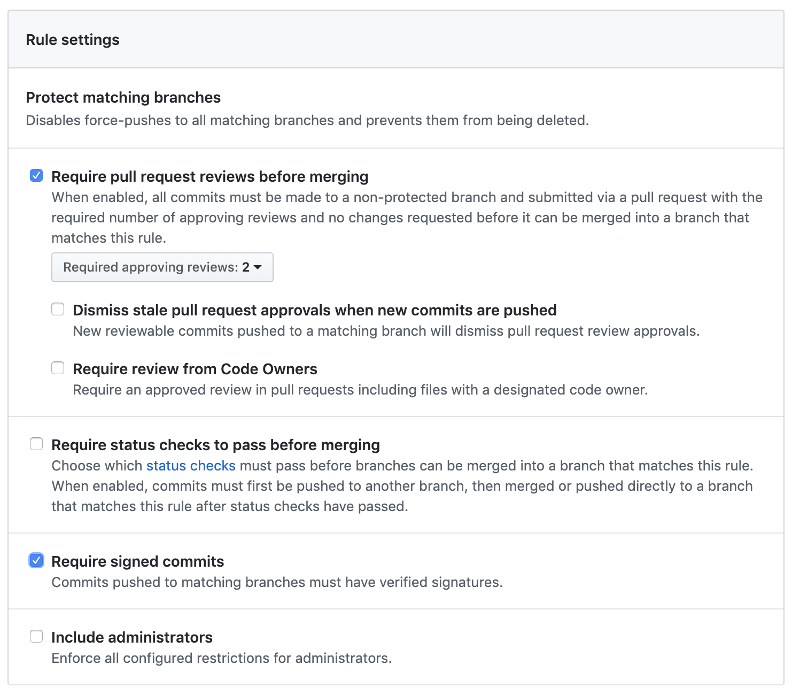

# Undo an unsquashed merge

We recently had a case where one of our protected branches (let's call it `develop`) - was not configured to prevent an admin from merging changes via the terminal.

Someone accidentally merged a work in progress branch into `develop` that had around 35 commits over the span of a month, without squashing.

This resulted in the `develop` branch history having valid squashed commits sprinkled with the indivual commits of the work in progress branch, over the span of a month.

The steps we took to fix the problem:

* ran `git log` on the `develop` branch
* searched the logs for the first individual commit from the wip branch
* grabbed the commit hash from the _previous_ log entry. From the example log below, that would be `cf871aeae0f69ca747a58943bf9daab8353b568c`

```
commit 8244efebc14c1b6efa4f38d1c78299593521023c
Author: Luis Colon <luiscolon62@gmail.com>
Date:   Fri Apr 26 19:12:38 2019 -0400

    TIL: Rspec shared context with variables

commit 5614983bc61a718858fbff255bb8f595700a4afd
Author: Luis Colon <luiscolon62@gmail.com>
Date:   Fri Apr 26 16:41:13 2019 -0400

    [The FIRST individual commit from wip branch]

commit cf871aeae0f69ca747a58943bf9daab8353b568c
Author: Luis Colon <luiscolon62@gmail.com>
Date:   Fri Apr 26 16:04:13 2019 -0400

    TIL: Created this repo, woot
```

* ran `git rebase -i [commit hash]`
* from the example above, it would be `git rebase -i cf871aeae0f69ca747a58943bf9daab8353b568c`

You should see something like:

```
pick 5614983 Squashed commit we want to keep
pick 8244efe Squashed commit we want to keep
pick 5dc29c4 Individual commit from wip branch
pick ff08317 Individual commit from wip branch
pick 1b4346d Squashed commit we want to keep
pick ae3da82 Individual commit from wip branch
pick cd2e6bf Individual commit from wip branch
pick f3a6101 Squashed commit we want to keep
pick 4559780 Individual commit from wip branch
pick d8eeb68 Individual commit from wip branch
pick d001452 Individual commit from wip branch
pick e70c139 Squashed commit we want to keep
pick fb12d3f Individual commit from wip branch
pick 94f0eed Individual commit from wip branch
pick 55fc9dc Individual commit from wip branch
pick 0592304 Squashed commit we want to keep
pick 0bdaf80 Squashed commit we want to keep
pick a6dd3a7 Squashed commit we want to keep
pick 39e5f5c Individual commit from wip branch
pick 8c7ae81 Squashed commit we want to keep

# Rebase cf871ae..8c7ae81 onto cf871ae (20 commands)
#
# Commands:
# p, pick <commit> = use commit
# r, reword <commit> = use commit, but edit the commit message
# e, edit <commit> = use commit, but stop for amending
# s, squash <commit> = use commit, but meld into previous commit
```

Changed the word `pick` to `d`, saved, and proceeded with the rebase.

```
pick 5614983 Squashed commit we want to keep
pick 8244efe Squashed commit we want to keep
d 5dc29c4 Individual commit from wip branch
d ff08317 Individual commit from wip branch
pick 1b4346d Squashed commit we want to keep
d ae3da82 Individual commit from wip branch
d cd2e6bf Individual commit from wip branch
pick f3a6101 Squashed commit we want to keep
d 4559780 Individual commit from wip branch
d d8eeb68 Individual commit from wip branch
d d001452 Individual commit from wip branch
pick e70c139 Squashed commit we want to keep
d fb12d3f Individual commit from wip branch
d 94f0eed Individual commit from wip branch
d 55fc9dc Individual commit from wip branch
pick 0592304 Squashed commit we want to keep
pick 0bdaf80 Squashed commit we want to keep
pick a6dd3a7 Squashed commit we want to keep
d 39e5f5c Individual commit from wip branch
pick 8c7ae81 Squashed commit we want to keep

# Rebase cf871ae..8c7ae81 onto cf871ae (20 commands)
#
# Commands:
# p, pick <commit> = use commit
# r, reword <commit> = use commit, but edit the commit message
# e, edit <commit> = use commit, but stop for amending
# s, squash <commit> = use commit, but meld into previous commit
```

* ran `git push -f origin develop`

## Notes

Before you can force push, you need to delete any protection rules you have on the `develop` branch via github.



After you force push, you should immediately add them back.

### What about existing branches and pull requests?

#### Pull requests

Pull requests will show that the code has conflicts and more files in the request than anticipated until ...

#### Branches

Anyone who has a branch with `develop` as it's origin will need to rebase to the updated `develop` branch.

```
git checkout develop
git pull
git checkout my-awesome-branch-with-awesome-code
git rebase -i develop
```

Or however you prefer to rebase.

## Prevention

To prevent admins from updating protected branches via the terminal, you will have to set two protection rules:

* Require pull request reviews before merging _(duh)_
* Include administrators

With those set, any changes to the protected branch must be done via github.

